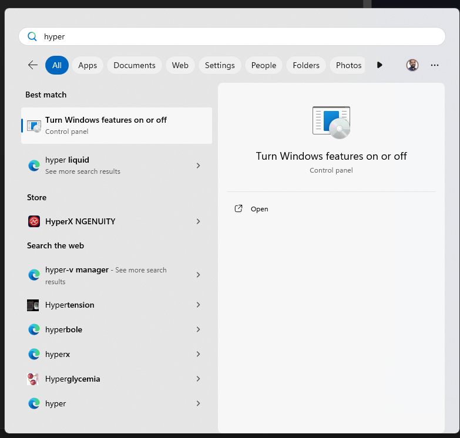
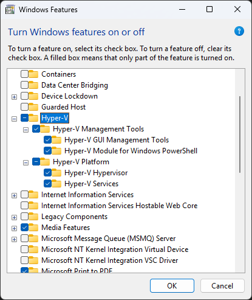
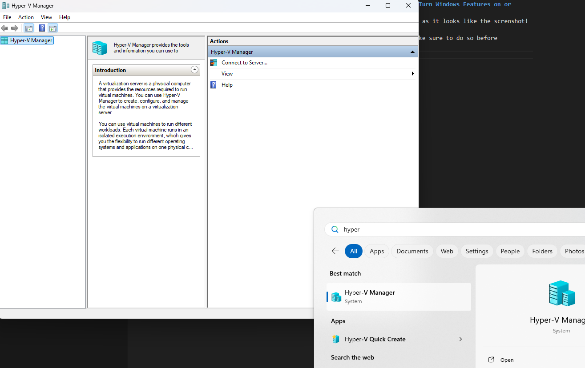
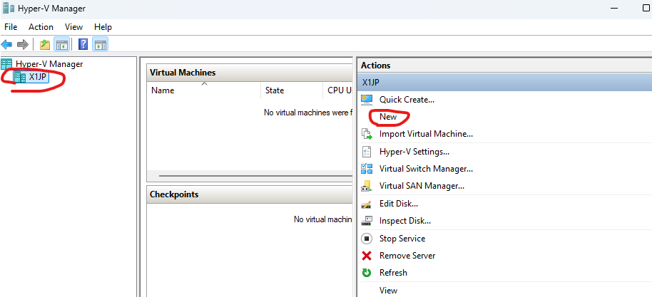
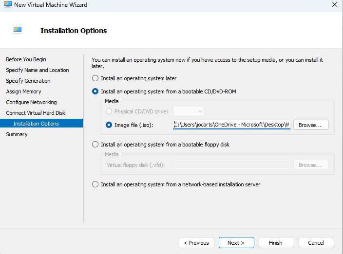
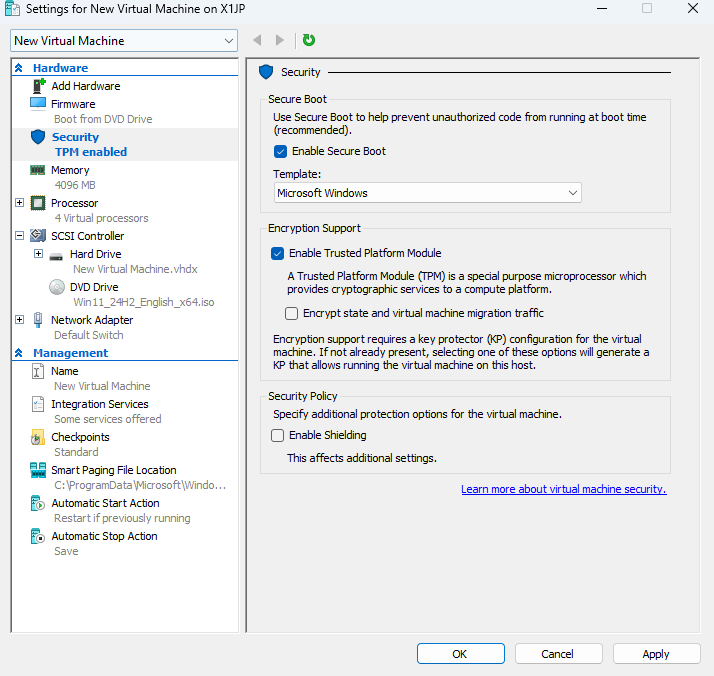
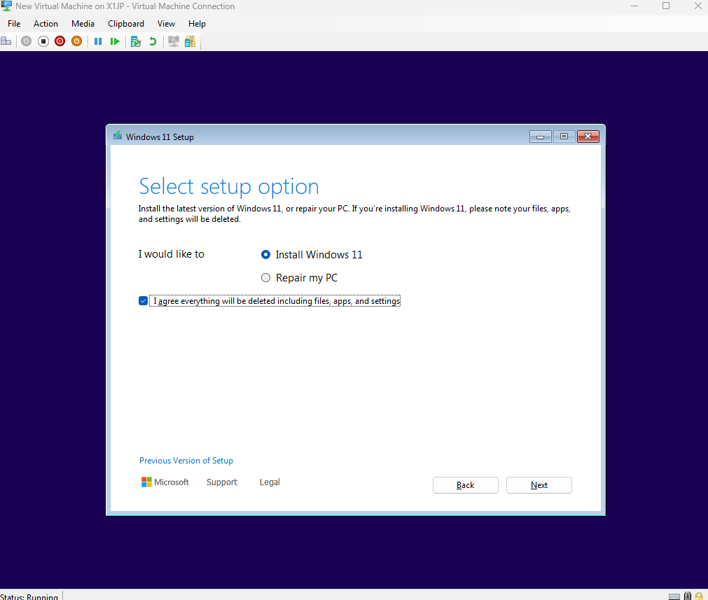
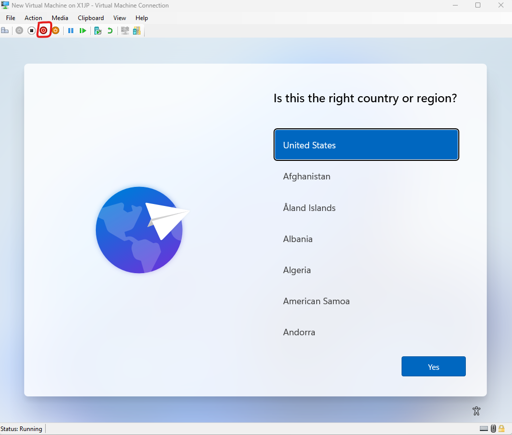

### Enable Hyper-V on Windows 11.
This enablement is required to do beforehand, as it'll require a restart. As long as you keep your local virtual machines off, you should not see any performance impact; if you need to later, you can follow these same instrucctions and disable it. 

1. Let's begin with clicking on Start - type "Windows Features" and open "**Turn Windows Features on or Off**"
2. Search for Hyper-V and enable the tick. A partial Tick is ok here as long as it looks like the screnshot
3. Internet connection is required, and press ok. Will ask for a restart, make sure to do so before continuing. 
4. After a bit of a long restart, you should see Hyper-V Manager on your start menu, open it: 

You're ready to create a VM now.

### Create Windows 11 VM

1. If you have an active Visual studio Subscription (with your @microsoft.com account), go to the [Subscription Portal](https://my.visualstudio.com/downloads) and download Windows 11 Pro or Enterprise. Choose the most up to date version available. If you don't know how, or don't have Visual Studio, download an eval version from [here](https://www.microsoft.com/en-us/software-download/windows11). Either way save it in any folder in your local disk, as long as it's not the Downloads folder. 
2. In Hyper-V Manager, Clik on your Computer Name Node, and click on New, Virtual Machine: 
3. On the Wizard, in the Before you Begin, click next. On the Name and Location, specify a VM Name, something like "DemoPC" would work. Leave the default location. Click Next
4. Select Generation 2, click next
5. For the Memory, you could easily go with 1/4 of your total computer RAM, but not less than 8GB of Ram (8192 MB). Leave the default Dynamic Memory enabled. Click Next
6. On the Networking, select the "Default Switch". Click Next
7. On the Harddrive, unless you've partitioned your disk before, leave all the defaults, including the 127 GB of disk. Click Next
8. On Installation Options, select "Install an Operating System from a bootable CD/DVD-Rom", then select "Image File" and click on Browse to select the ISO you downloaded on step 1. Should look like this: . Click Next.
9. Review the configurations, and click on Finish. 
10. With the VM on the list, right click on it and select Settings 
11. On the VM Settings dialog, click on Security and enable (if not enabled) **Secure Boot** and **Trusted Platform Module**. Click OK. 

### Install Windows
 _This is the new version of Windows Setup. If you downloaded Windows 11 24h2 or newer it'll look like this. If not, follow along making these selections._

1. You should now see the VM on the list of Virtual Machines. Double click on it, and click start.
2. Quickly after clicking start, you'll see a message saying "Press any key to boot from cd". Press any key

3. The Windows 11 installation should appear. Select language and time format next, and then keyboard, and click next

4. On the setup option, select "Install Windows 11" and check on "I Agree on everything will be deleted....": . Click Next

5. On the Product Key, click on "I don't have a product key" (we will activate later, don't worry. )

6. On the Select Image screen, if you have an option, make sure to select any of the following:
    
    - Windows Enterprise 
    - Windows Enterprise N (*preferred*)
    - Windows Pro
    - Windows Pro N

Even thought Windows 11 Education technically would work, we won't have the right license for it. 

7. Accept the Licenses Terms.
8. On the Disk Selection, simply left the "DISk 0 Unallocated space..." selected and click next
9. When Ready to Install, click Install. Let's wait a bit

**Important**: We don't want to finish the setup of Windows after the next screen. When you see the OOBE experience as the next screenshot, please shutdown the VM using the hightlighted icon below. We will continue later. 

### Navigation
[Repo](https://github.com/JPCortesP/DemoBuilder) | 
[Index](index.md) | 
[Next >>](1-InitialStepsandReqs.md)