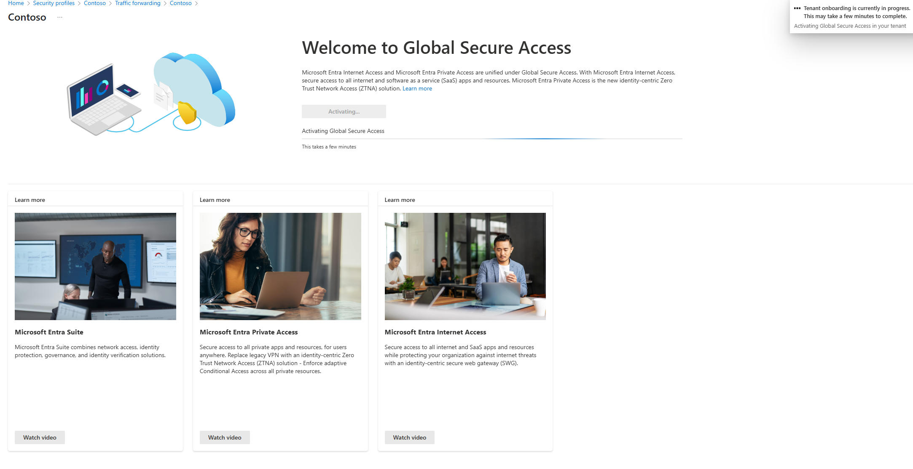
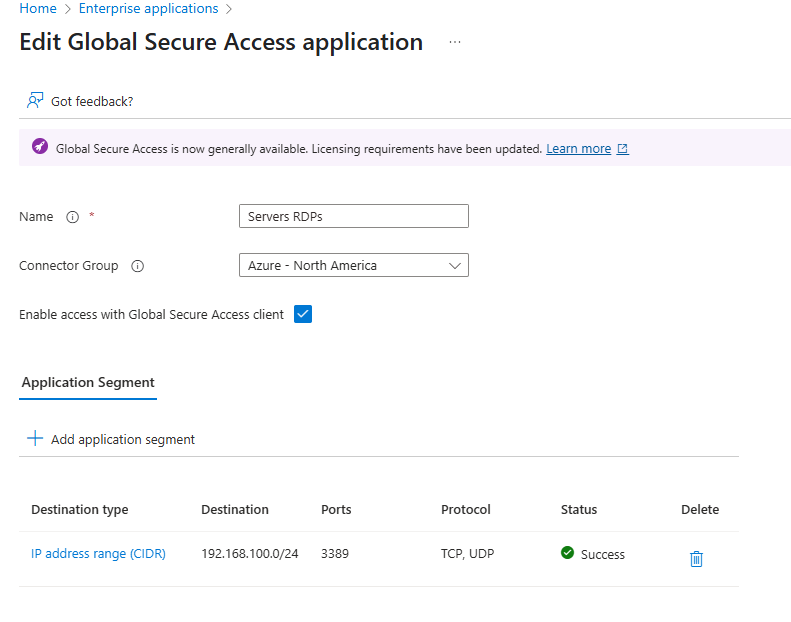
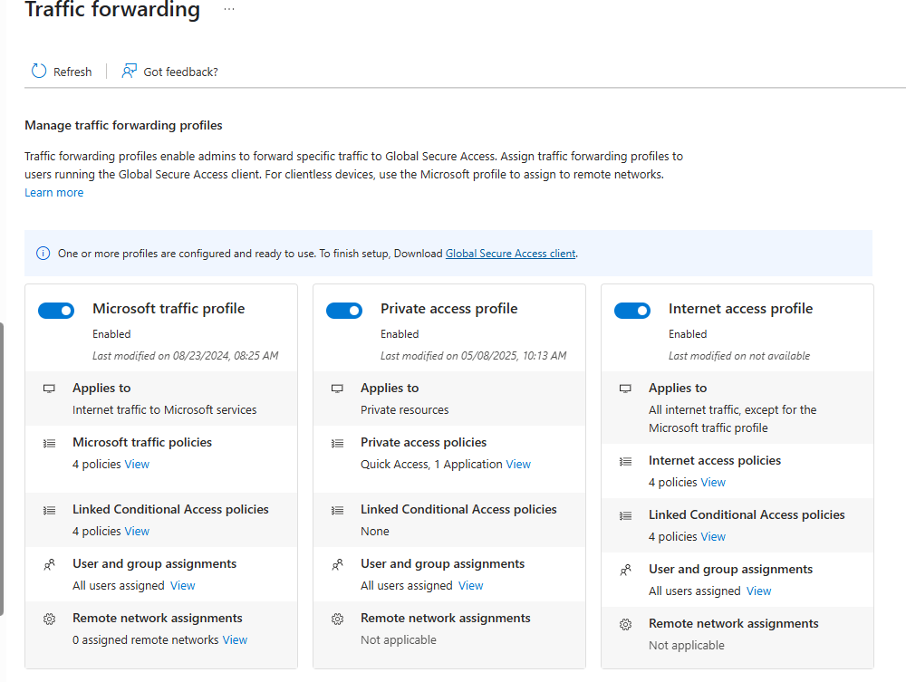

## Entra ID Private Access Fun
We are almost there! Here's what we are going to configure on this section:

1. Enable Entra Private Access
   1.  *When accessing for the first time, you'll see the Activate Button. Click on it and wait*
2. Install a couple of connectors  
   3. Follow this https://learn.microsoft.com/en-us/entra/global-secure-access/how-to-configure-connectors#install-and-register-a-connector. Pre-Reqs on this page don't apply
   
   4. Install connector at least on the CloudCon Azure Server. You can also and optionally install it on DC01 as well. 
   5. On the Azure Portal, GLobal Secure Access, Connect and Connectors. There, create a new Connector group, with "Azure" name, and select all the connectors you have
   6. Connectors should be "Active"
3. Add RDP to the servers as test app
   1. On the Entra Portal, Global Secure Access, Applications, Enterprise Applications
   2. Name it Servers RDP (you could add 1 server per app, but here we will add the whole network segment)
   3. Select your Connector Group you created on 2.5 before
   4. Add App Segment
      1. Destination Type: IP Address Range (CIDR)
      2. Starting Address: 192.168.100.0
      3. Network Mask: /24 (256 Addresses)
      4. Ports: 3389
      5. Protocol: TCP,
      6. Click Apply
   5. Click Save on your App. You should see this: 
   6. Add your user(s) to the App you just created. 
      1. In GSA, go to Applications, Enterprise Apps, and click on your App
      2. Click on Users and Groups
      3. Add either your user, or your `Pim-Enabled-Admins` you created on step 4 - Active Directory
      4. **If you have problems accessing, you can come back later and click on sign-in logs and check if a Policy is blocking you**
   7. Optionally to require MFA, go to Conditional Access and create a new Policy
      1. Name: RequireMFAForRDP
      2. Assign to all users
      3. on Target Resources, select resources, select Servers RDPs app you created before
      4. Conditions, select Windows as the Device Platform
      5. Access Control, select Require Multifactor Auth or Require Auth strength as needed by your config. Enable Policy and create. 
      6. This will require MFA the first time you connect via RDP to your servers while using GSA client. 
4. In Entra Portal, go to GSA, Connect, Traffic Forwarding and enable all profiles:*your data might be incomplete or different, its fine, my environment has a lot more stuff. Also, if you can't enable any of the profiles, yell, I might have forgotten something*
5. Manually deploy the Global Secure Access client to your hyper-v VM
   1. Manually deploy the client. https://learn.microsoft.com/en-us/entra/global-secure-access/how-to-install-windows-client This time we will use the manual installation. 
   2. Make sure to open the agent and login. IT could be auto-login but our installation of SSO and KSO are too fresh, so lets make sure is automatic.

6. Test the installation
   1. Now, Open the RDP Client of your choice in your Hyper-VM, and test your connection: `192.168.100.4`, port is automatic. If you see the login prompt, use your credentials 
   2. You now should see either MFA if you configured it, and then your desktop. If it works, **Urgently do next step**
7. When able to RDP into the VMs from your Hyper-V VM, **GO and remove the RDP open entry from your MotherOfNSG**. ([See here](2-RGs_and_Network.md)) It should be called `AllowMyIpAddressRDPInbound`

# Your Lab is ready!

[Repo](https://github.com/JPCortesP/DemoBuilder) | 
[Index](index.md) | 
[Next >>](7-W11-oobe.md)