## Finish setting up W11

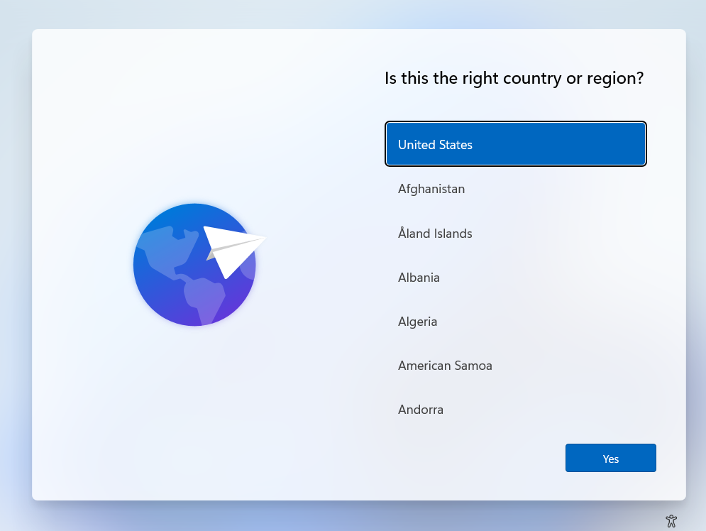
Now that we are finally here ready to enable our final step, with the Windows Machine, this is the screen we should see on the VM. Let's start:

1. Select your country and hit Yes. I usually just leave US
2. This is personal, select your KB layout and hit yes
3. You can add a second layout, I usually add Latin American as I use a Latin American Keyboard. 
4. Windows will check for Updates and even might restart itself. Nothing to do but wait: 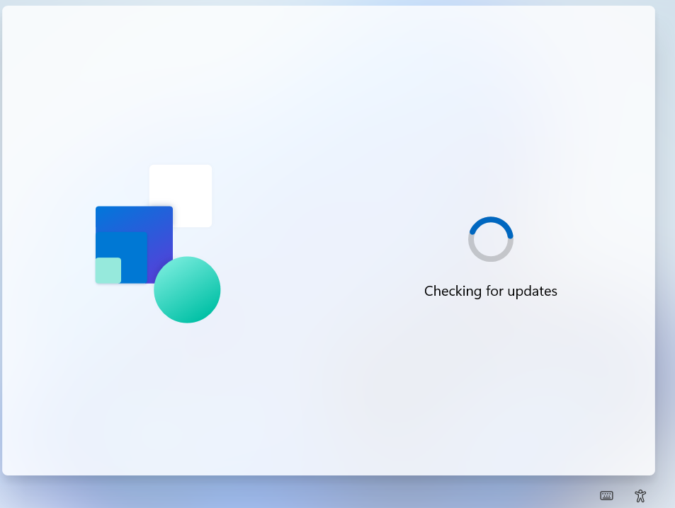
5. After the updates, Windows should automagically connect to a network. It'll show up as cable/ethernet connection, hit next. If it doesn't connect, let us know. 
6. You can Name your device. **I strongly recommend you to use a descriptive name, like CloudSAW**. If you do, Windows will restart again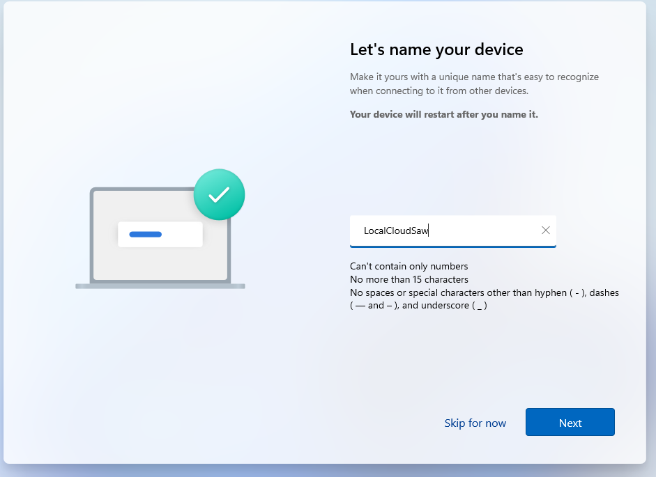 *SAW here means secure Admin Workstation*
7. When it gets back, Its the most important part of the whole thing. If you went with Pro or Enterprise image, you should see this: 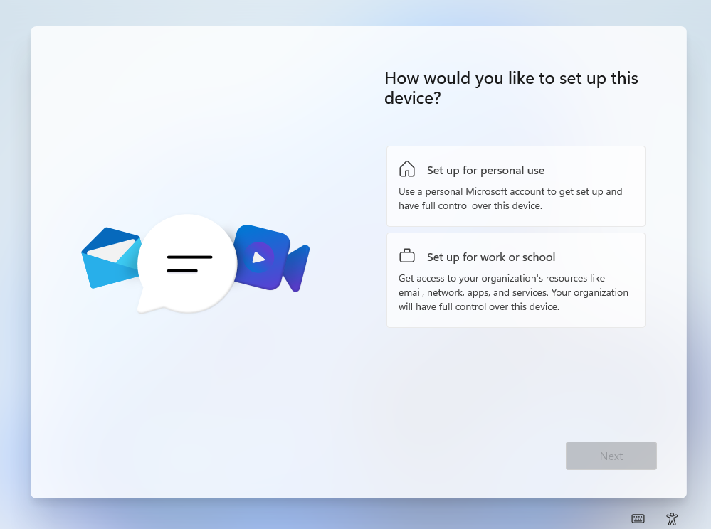. Select Set up for Work or School and hit next
8. Login with your user, the one you created, and pass any MFA challange 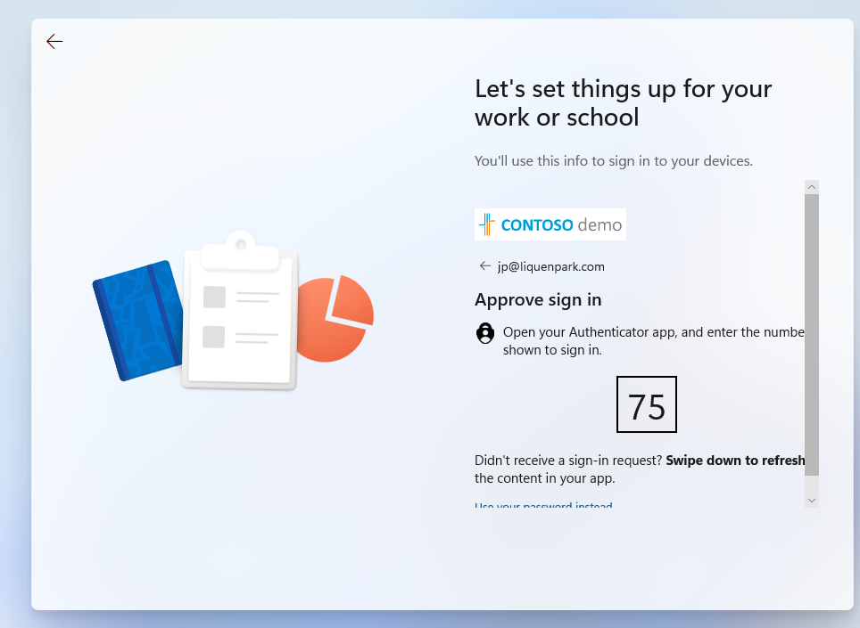
9. Now, Windows will do its thing: 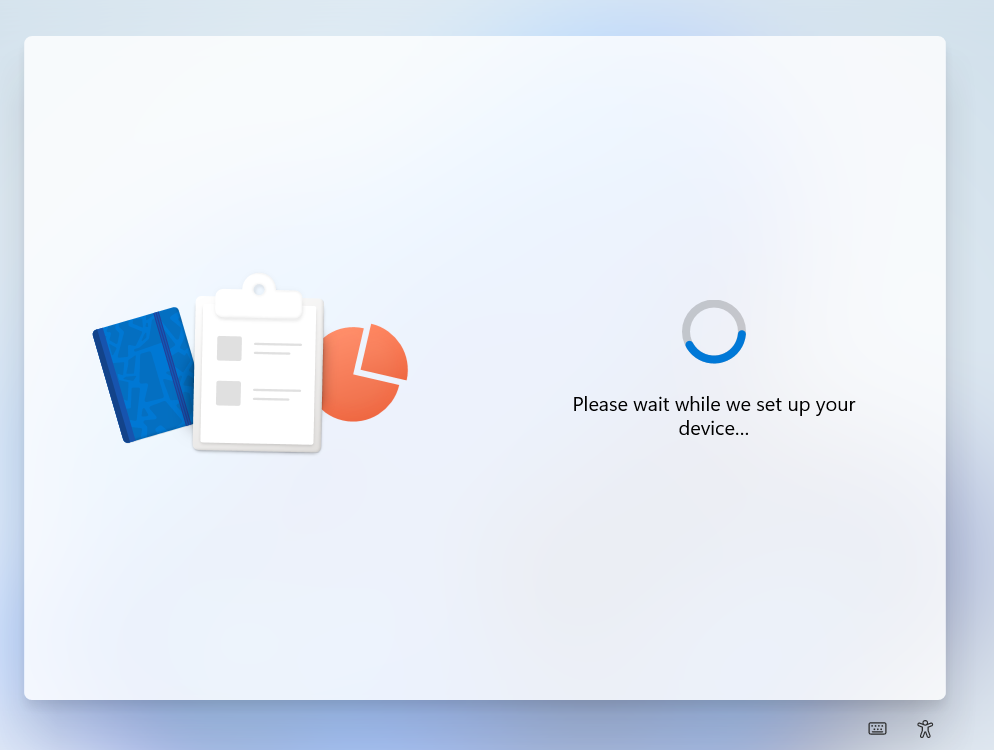 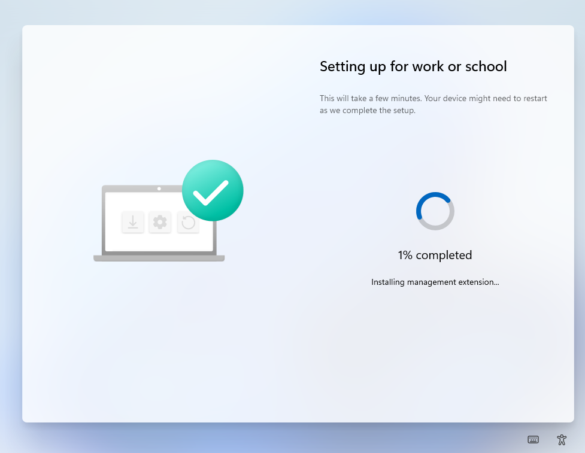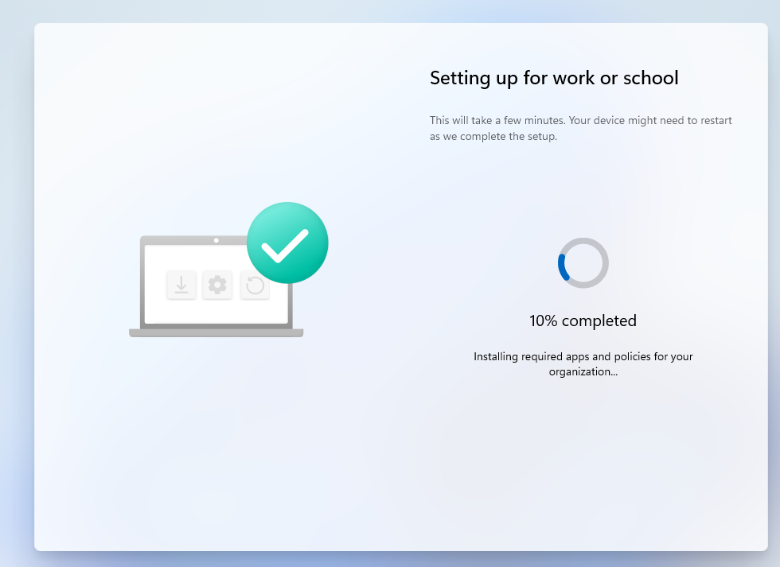
10. It will take a while, get yourself some coffee. In my fully setup environment, took a bit more than 30 minutes. I'm auto-installing Office which is a bad idea if you're in a hurry, yours should be faster. 
11. Before long, you should see something like this. Click Next 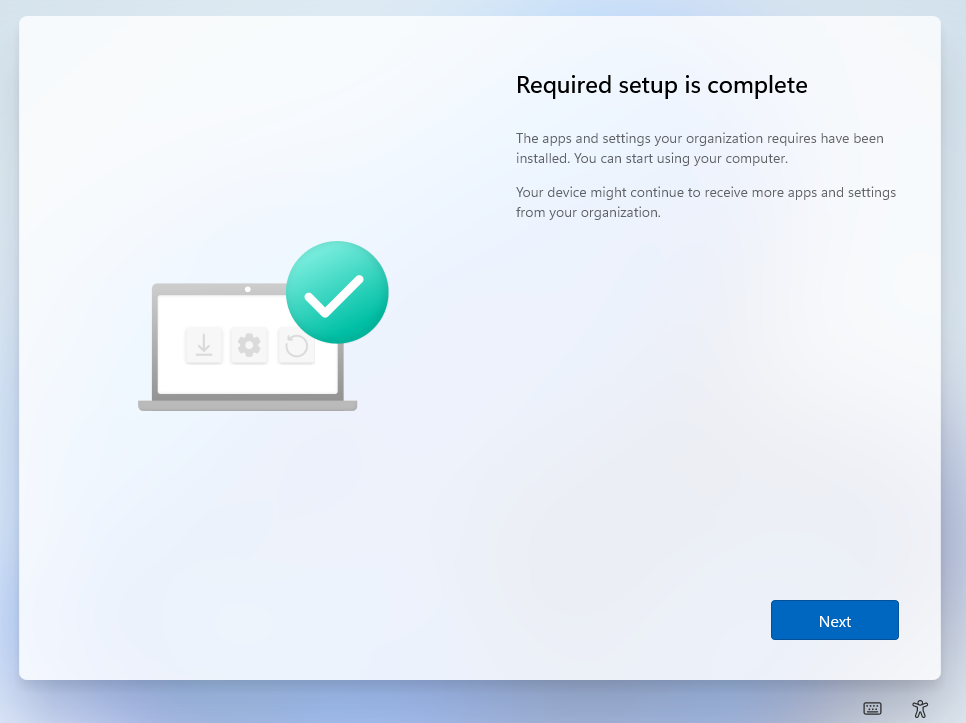
12. Select your privacy settings, default should be ok, and hit next. 
13. A new Windows Update check is here, so again, wait. 
14. After a bit, Windows should say hi to you: . I won't take any more screenshots, but you should eventually see this: 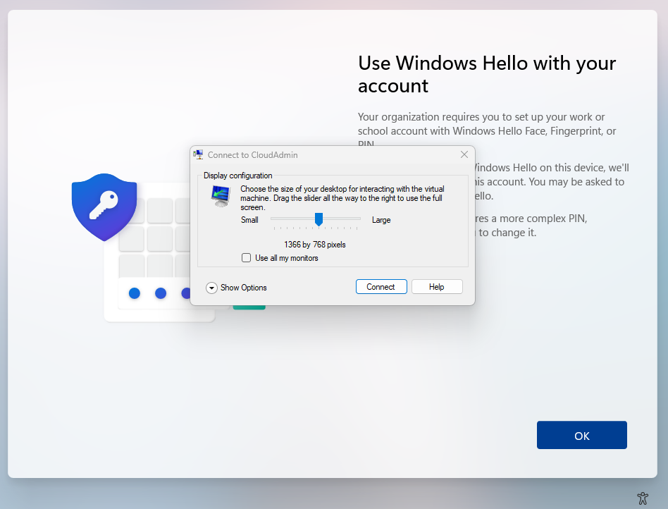
15. Hit connect, and either try to set up Windows Hello, or if you see the login screen, simply login with your password. After login, you might see Windows Hello prompt again, try to do it. 
    1.  Windows Hello should ask to pass a MFA challenge.
    2.  It might fail since we haven't configured everything yet, so Continue for Now if it fails its fine. 
16. Windows is ready. 

### A few post-installation recomendations.

No specific instructions will be provided, but a quick copilot chat or bing search should bring you the instructions.

* Install Company Portal, either via Intune or locally on your store.
* Install M365 Apps, either via Intune or Locally on your store. 
* Configure OneDrive to auto-login and auto-sync/backup your folders. This is part of the anti-ransomware protection.
* Inmediately after a few minutes in the desktop, run Windows Update. 
  * You might want to enable Delivery Optimization locally on your VM. 
* Configure some Defender Policies on Intune
* Configure AutoPatch and let it rip thru your VMs

## Test Global Secure Access client

After a few minutes, GSA should be installed and should have auto-connected: 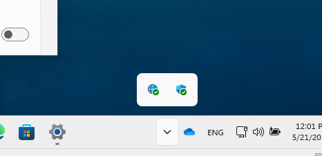

Since we only enabled RDP ports, 3389, the following should happen:
* if you ping your DC01 IP, **should fail**: 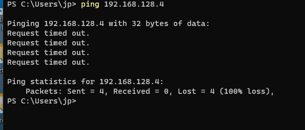 (don't mind my DC01 IP being different, make sure to use yours. )
* Trying to connect via RDP to the same IP, **should work**: 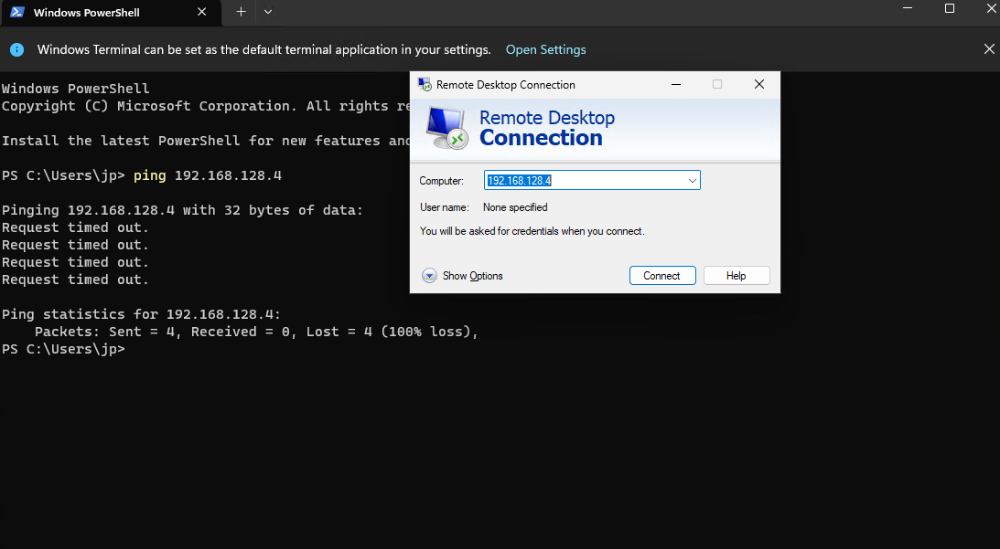 and ask for your credentials and even maybe MFA again: 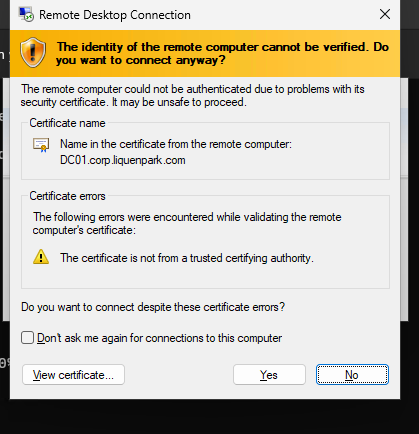. Hit yes

[Repo](https://github.com/JPCortesP/DemoBuilder) | 
[Index](index.md) | 